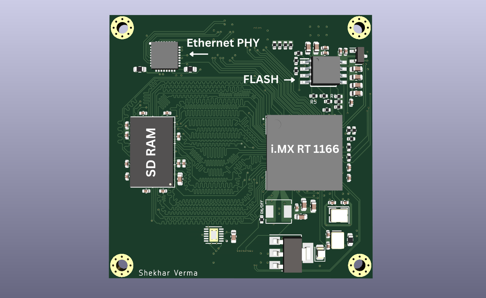
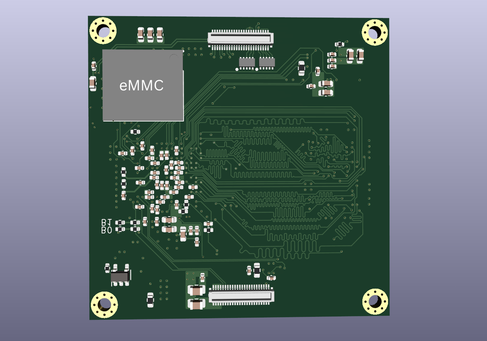

You can read the full blog post [here](https://shekharverma.com/posts/imxrt_som/)!

**The SoM Features**
* i.MX RT 1160 MCU (MIMXRT1166DVM6A)
* 128 Mb SD RAM
* 128 Mb QSPI Flash
* 4 Gb eMMC
* 10/100 Mbps RMII Ethernet PHY
* 2 Lane MIPI-DSI
* 2 Lane MIPI-CSI
* 2 X USB 2.0
* 2 X I2C
* UART to USB Convertor
* Multiple GPIOs
* 2 X 48 Pin Board-to-Board Connector

